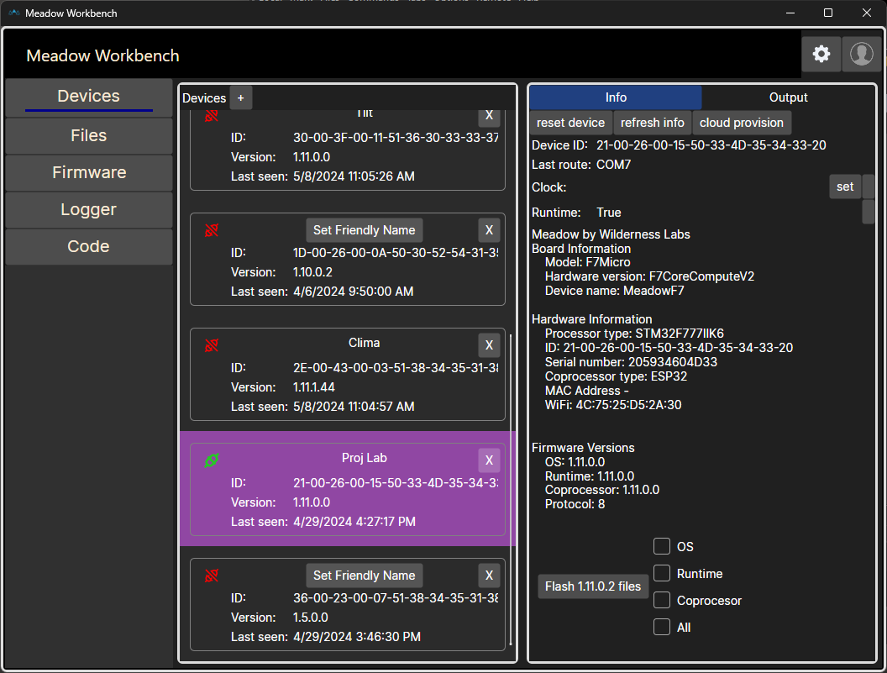
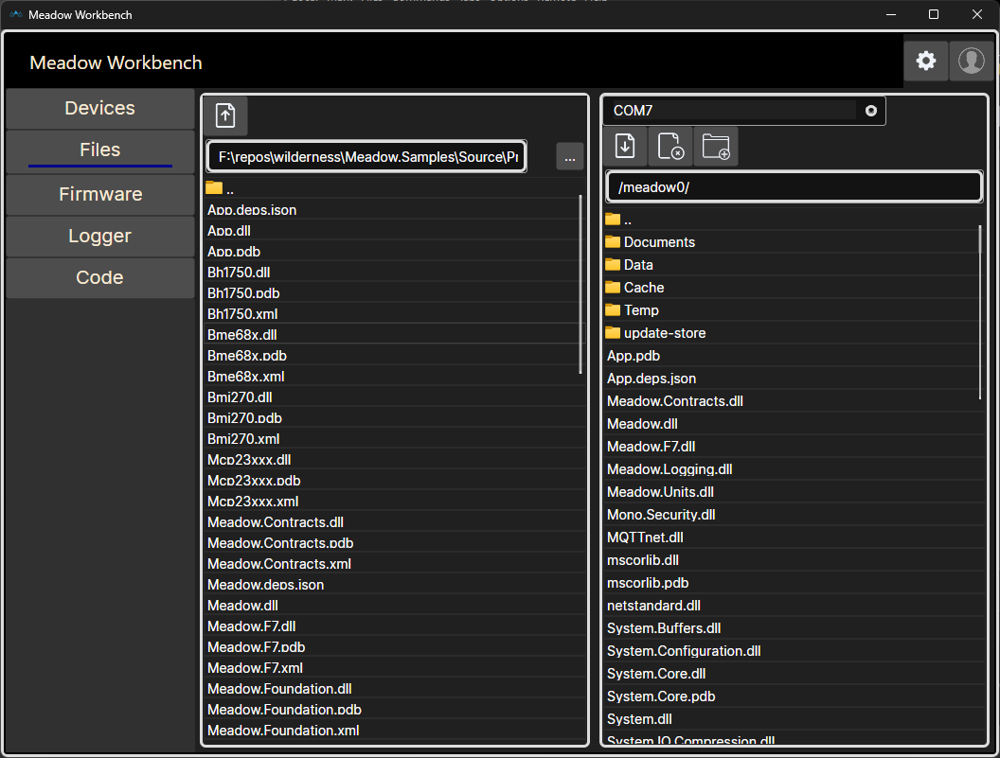
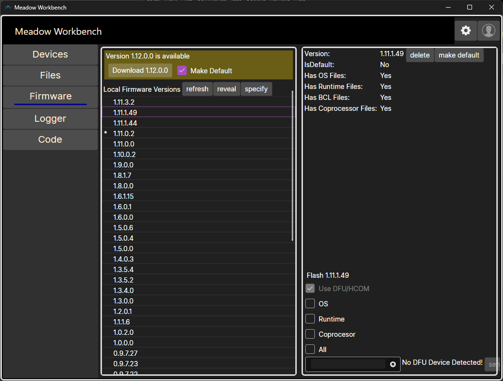
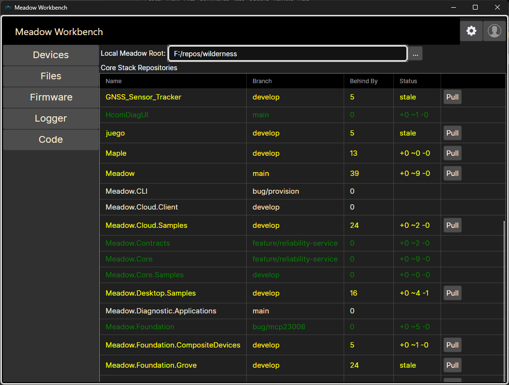

# Meadow.Workbench

Meadow Workbench is a cross-platform management tool for Meadow devices.  It uses Avalonia to provide support for Windows, Mac and Linux host machines.

## Device Management

The Devices Feature shows information about all known devices and their connection state.  It allows you to:
- Update to the latest firmware
- Reset the device
- Set the device clock
- Provision the device with meadow.Cloud

## File Management
The Files Feature allows you to:
- Browse the files on the device
- Browse a local directory
- Copy files to/from the device and local directory
- Delete device files

## Firmware Management
The Firmware Feature allows you to:
- View all local firmware versions
- Download new firmware versions from Wilderness Labs
- Push any firmware version to a connected device
- Delete local firmware packages
- Set the default firmware package

## UDP Log Client
The Logger Feature allows you to:
- Listen on a UDP port for messages from Meadows logging to the `UDPLogger`

## Local Repository Management
The Code Feature allows you to:
- Define your local root Meadow code folder
- View the state of all source repositories in that folder
- Clone any repositories missing that are needed to build the Meadow software stack
- Pull any repositories that are out of date

